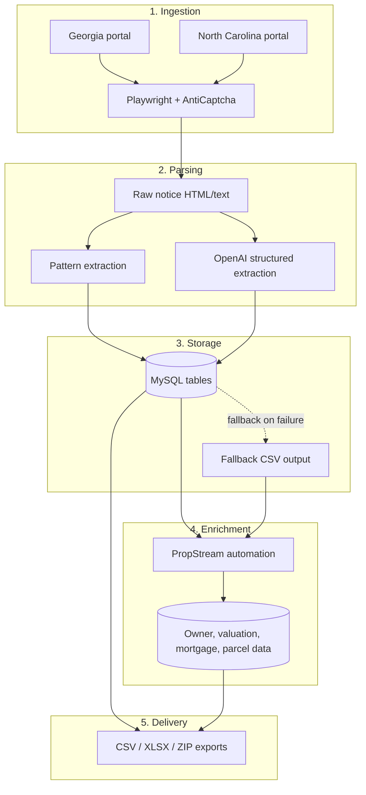

# Real-Estate Public Notice Intelligence

Automated workflow for collecting, parsing, storing, and enriching public real estate notice data from Georgia and North Carolina portals. The system scrapes legal notices, extracts structured property data, enriches records through PropStream, and exports consolidated reports for lead generation and research workflows.

## Overview

This project is built for real-estate data acquisition from public legal notices such as foreclosure, tax sale, trustee sale, and property-related notices. It combines:

- Playwright-based browser automation
- AI-assisted extraction using OpenAI
- MySQL storage with CSV fallback
- PropStream enrichment for deeper property intelligence
- Batch export to CSV/XLSX/ZIP files

## Architecture Flow



## Key Features

- Multi-state public-notice scraping for Georgia and North Carolina
- AI-powered extraction for complex legal text and notice records
- PropStream enrichment for valuation and owner/property details
- MySQL database support with resilient local CSV fallback
- Automated export to CSV/XLSX/ZIP reports
- Configurable runtime modes for development, testing, and faster execution

## Project Structure

- `gapubs.py` — Georgia public notice pipeline
- `ncpubs.py` — North Carolina public notice pipeline
- `propstreams_ga.py` — Georgia enrichment flow
- `propstreams_nc.py` — North Carolina enrichment flow
- `db_file.py` — MySQL connection and query wrapper
- `enrich_pubs.py` — enrichment and normalization helpers
- `export_pub_tables.py` — export utility for final datasets
- `helper_consolidated.py` — shared browser and parsing logic
- `exports/` — generated export files and fallback CSVs
- `requirements.txt` — Python dependencies

## Setup

1. Create a Python environment
   ```bash
   python -m venv venv
   .\venv\Scripts\activate
   ```

2. Install dependencies
   ```bash
   pip install -r requirements.txt
   playwright install chromium
   ```

3. Create a `.env` file in the project root
   ```env
   DB_HOST=localhost
   DB_USER=root
   DB_PASSWORD=your_password
   DB_NAME=public_notice_db
   USE_DB=1

   OPENAI_API_KEY=your_openai_api_key
   ANTICAPTCHA_KEY=your_anticaptcha_key

   PROPSTREAM_EMAIL=your_email
   PROPSTREAM_PASSWORD=your_password

   DEV_MODE=1
   FAST_MODE=1
   ```

## Usage

Run the Georgia workflow:
```bash
python gapubs.py
```

Run the North Carolina workflow:
```bash
python ncpubs.py
```

Run the property enrichment workflow:
```bash
python propstreams_ga.py
python propstreams_nc.py
```

Export prepared data tables:
```bash
python export_pub_tables.py
```

## Notes

- The project is designed for automation-heavy, data-collection workflows and may require valid site access, account credentials, and API keys.
- Data files in `exports/` and other local runtime artifacts are intentionally excluded from Git tracking by the repository ignore rules.

## License

MIT
